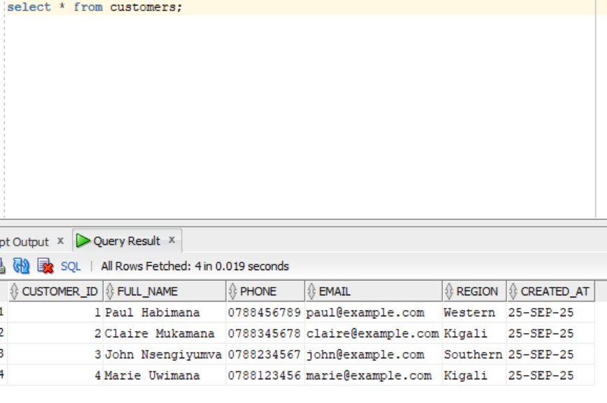
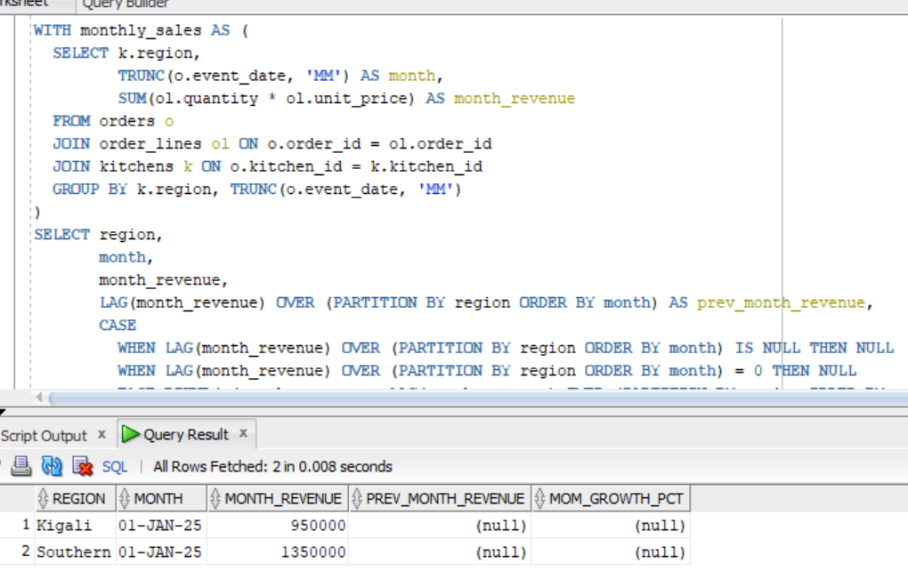
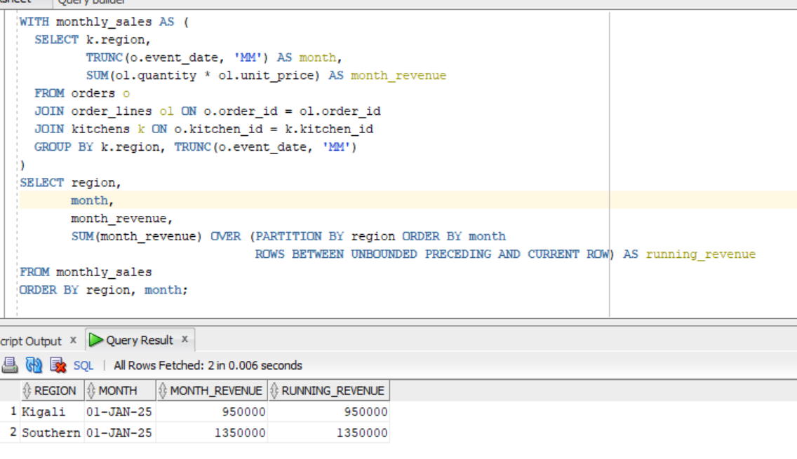

# plsql-window-functions-Hagenimana-AimeDeDieu
#  Problem definition 

Business Context: ADD'S CUISINE is a catering & delivery business specializing in weddings, funerals, corporate events and other ceremonies in Rwanda. They operate regional kitchens and deliver to venues.
Data Challenge: Management needs analytical queries to identify top-selling menu items by region/quarter, track running monthly revenue, compute month-to-month growth for planning, segment customers by revenue, and compute 3-month moving averages for demand forecasting.
Expected Outcome: Produce actionable insights: (1) top menu items per region/quarter to prioritize inventory and promotions; (2) customer segments for VIP targeting; (3) demand trends for staffing and ingredient procurement.

##  Success criteria — exactly 5 measurable goals 
-------------------------------------------------
Top 5 menu items per region per quarter : use RANK() to list top 5 by revenue (goal met if query returns 5 items per region/quarter).
--------------------------------------------------------
Running monthly revenue totals for each kitchen/region : SUM() OVER (PARTITION BY region ORDER BY month ROWS BETWEEN UNBOUNDED PRECEDING AND CURRENT ROW) (goal met if cumulative totals computed).

Month-over-month growth rate for each region :LAG() to compute previous month revenue and growth% (goal met if growth% computed for all months after first).

Customer revenue quartiles : NTILE(4) to assign customers to quartiles (goal met if customers distributed into 4 buckets).

3-month moving average of monthly sales for forecasting : AVG() OVER (PARTITION BY region ORDER BY month ROWS BETWEEN 2 PRECEDING AND CURRENT ROW) (goal met if 3-month averages computed).

##  Database schema 
-------------------
Overview (minimum 3 related tables)

customers: stores customer profiles.

kitchens: regional kitchens (delivery origin).

menu_items: products / items (dishes / packages).

orders: transaction header (one order per event).

order_lines: order details (item & qty) — this is essential for proper revenue calculations.

# screenshoots
Table of Customers and data
-------------------------

---------------------------------------
This is the the table and data of customers i created and in folder of screenshots i pushed contains other screenshots of tables i created

Month-over-month growth (LAG/LEAD)
---------------------------------

-------------------------------------------
LAG() fetches previous month revenue; growth% is calculated safely (avoid division by zero). Use LEAD() similarly for forecasting or next-period comparisons

Running monthly sales totals (SUM() OVER) with frame
---------------------------------------

-----------------------------------------
This shows cumulative revenue for each region over time. Use ROWS frame for an exact preceding-rows window; for date-aggregates, ordering by month is appropriate.

#  References
Oracle Corporation. (2025). Error Messages Reference (ORA-00933, ORA-02291, etc.).
https://docs.oracle.com/error-help/

Itzik Ben-Gan (2019). T-SQL Window Functions: For Data Analysis and Beyond. Redgate Publishing.

Markus Winand (2012). SQL Performance Explained. Vienna: Markus Winand.
https://use-the-index-luke.com

Mode Analytics (2023). Introduction to SQL Window Functions.
https://mode.com/sql-tutorial/sql-window-functions/

Vertabelo Academy (2024). SQL Window Functions Tutorial.
https://academy.vertabelo.com/blog/sql-window-functions/
