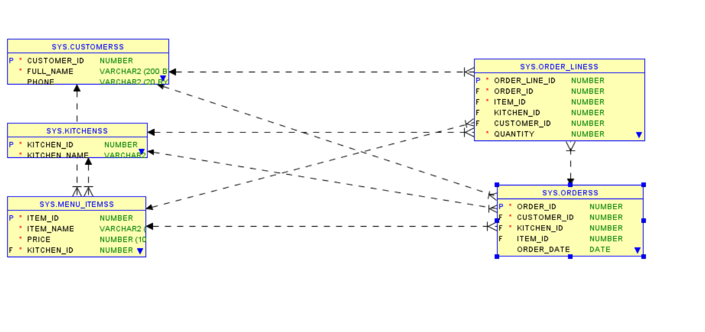
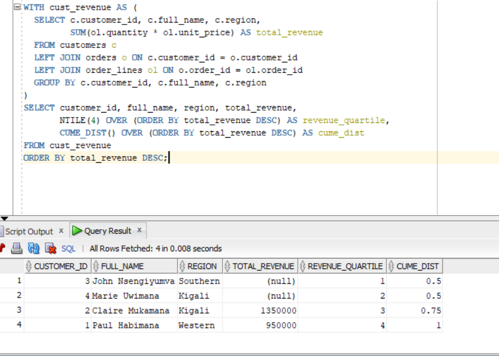

# plsql-window-functions-Hagenimana-AimeDeDieu
#  Problem definition 

ADD'S CUISINE is a catering & delivery business specializing in weddings, funerals, corporate events and other ceremonies in Rwanda. They operate regional kitchens and deliver to venues.
Data Challenge: Management needs analytical queries to identify top-selling menu items by region/quarter, track running monthly revenue, compute month-to-month growth for planning, segment customers by revenue, and compute 3-month moving averages for demand forecasting.
Expected Outcome: Produce actionable insights: (1) top menu items per region/quarter to prioritize inventory and promotions; (2) customer segments for VIP targeting; (3) demand trends for staffing and ingredient procurement.

#  Success criteria — exactly 5 measurable goals 
-------------------------------------------------
1.Top 5 menu items per region per quarter : use RANK() to list top 5 by revenue (goal met if query returns 5 items per region/quarter).

2.Running monthly revenue totals for each kitchen/region : SUM() OVER (PARTITION BY region ORDER BY month ROWS BETWEEN UNBOUNDED PRECEDING AND CURRENT ROW) (goal met if cumulative totals computed).

3.Month-over-month growth rate for each region :LAG() to compute previous month revenue and growth% (goal met if growth% computed for all months after first).

4.Customer revenue quartiles : NTILE(4) to assign customers to quartiles (goal met if customers distributed into 4 buckets).

5.3-month moving average of monthly sales for forecasting : AVG() OVER (PARTITION BY region ORDER BY month ROWS BETWEEN 2 PRECEDING AND CURRENT ROW) (goal met if 3-month averages computed).

##  Database schema 
-------------------
I have created 5 tables which are these:
----------------------------------
customers: stores customer profiles.

kitchens: regional kitchens (delivery origin).

menu_items: products / items (dishes / packages).

orders: transaction header (one order per event).

order_lines: order details (item & qty) this is essential for proper revenue calculations.

Table of Customers and data
-------------------------

---------------------------------------
This is the the table and data of customers i created and in folder of screenshots i pushed contains other screenshots of tables i created
ER-Diagram
-----------


## Step 4: Window Functions Implementation (4 pts)
 Navigation:
---------------------------------
Goal: Compute month-over-month revenue and growth%
```sql
WITH monthly_sales AS (
  SELECT k.region,
         TRUNC(o.event_date, 'MM') AS month,
         SUM(ol.quantity * ol.unit_price) AS month_revenue
  FROM orders o
  JOIN order_lines ol ON o.order_id = ol.order_id
  JOIN kitchens k ON o.kitchen_id = k.kitchen_id
  GROUP BY k.region, TRUNC(o.event_date, 'MM')
)
SELECT region,
       month,
       month_revenue,
       LAG(month_revenue) OVER (PARTITION BY region ORDER BY month) AS prev_month_revenue,
       CASE
         WHEN LAG(month_revenue) OVER (PARTITION BY region ORDER BY month) IS NULL THEN NULL
         WHEN LAG(month_revenue) OVER (PARTITION BY region ORDER BY month) = 0 THEN NULL
         ELSE ROUND( (month_revenue - LAG(month_revenue) OVER (PARTITION BY region ORDER BY month)) / LAG(month_revenue) OVER (PARTITION BY region ORDER BY month) * 100, 2)
       END AS mom_growth_pct
FROM monthly_sales
ORDER BY region, month;
```
Output:

-------------------------------------------
LAG() fetches previous month revenue; growth% is calculated safely (avoid division by zero). Use LEAD() similarly for forecasting or next-period comparisons

Aggregate: Running monthly sales totals (SUM() OVER) with frame
-------------------------
Goal: Running (cumulative) monthly revenue per region
```sql
WITH monthly_sales AS (
  SELECT k.region,
         TRUNC(o.event_date, 'MM') AS month,
         SUM(ol.quantity * ol.unit_price) AS month_revenue
  FROM orders o
  JOIN order_lines ol ON o.order_id = ol.order_id
  JOIN kitchens k ON o.kitchen_id = k.kitchen_id
  GROUP BY k.region, TRUNC(o.event_date, 'MM')
)
SELECT region,
       month,
       month_revenue,
       SUM(month_revenue) OVER (PARTITION BY region ORDER BY month
                                ROWS BETWEEN UNBOUNDED PRECEDING AND CURRENT ROW) AS running_revenue
FROM monthly_sales
ORDER BY region, month;
```


-----------------------------------------
This shows cumulative revenue for each region over time. Use ROWS frame for an exact preceding-rows window; for date-aggregates, ordering by month is appropriate.

 Distribution: Customer quartiles (NTILE(4) and CUME_DIST)
 ------------------------
-- Goal: Segment customers into revenue quartiles using lifetime revenue
```sql
WITH cust_revenue AS (
  SELECT c.customer_id, c.full_name, c.region,
         SUM(ol.quantity * ol.unit_price) AS total_revenue
  FROM customers c
  LEFT JOIN orders o ON c.customer_id = o.customer_id
  LEFT JOIN order_lines ol ON o.order_id = ol.order_id
  GROUP BY c.customer_id, c.full_name, c.region
)
SELECT customer_id, full_name, region, total_revenue,
       NTILE(4) OVER (ORDER BY total_revenue DESC) AS revenue_quartile,
       CUME_DIST() OVER (ORDER BY total_revenue DESC) AS cume_dist
FROM cust_revenue
ORDER BY total_revenue DESC;

#  References
Oracle Corporation. (2025). Error Messages Reference (ORA-00933, ORA-02291, etc.).
https://docs.oracle.com/error-help/

Itzik Ben-Gan (2019). T-SQL Window Functions: For Data Analysis and Beyond. Redgate Publishing.

Markus Winand (2012). SQL Performance Explained. Vienna: Markus Winand.
https://use-the-index-luke.com

Mode Analytics (2023). Introduction to SQL Window Functions.
https://mode.com/sql-tutorial/sql-window-functions/

Vertabelo Academy (2024). SQL Window Functions Tutorial.
https://academy.vertabelo.com/blog/sql-window-functions/
```
Output:
---

---------
 NTILE(4) places customers into four buckets; top revenue customers will be in quartile 1. CUME_DIST() gives cumulative distribution useful for percentile thresholds.
## References
Oracle Corporation. Oracle® Database SQL Language Reference 21c. Oracle Docs. https://docs.oracle.com/en/database/oracle/oracle-database/21/sqlrf/index.html

Oracle Corporation. Oracle® Database PL/SQL User’s Guide and Reference 21c. Oracle Docs. https://docs.oracle.com/en/database/oracle/oracle-database/21/lnpls/index.html

T. Poder. Oracle SQL for Performance Tuning: Analytic Functions in Action. Blog Article. https://tanelpoder.com

Mode Analytics. SQL Window Functions Tutorial. https://mode.com/sql-tutorial/sql-window-functions

SQLZoo. SQL Tutorial: Window Functions. https://sqlzoo.net/wiki/Window_functions

KDNuggets. Using SQL Window Functions for Customer Analytics. https://www.kdnuggets.com/

“SQL for Data Analysis” (Book) — C. Chen, O’Reilly Media, 2020

Stack Overflow. Questions and Solutions on LAG(), LEAD(), NTILE(), RANK(). https://stackoverflow.com/questions/tagged/window-functions

Oracle Dev Gym. Hands-on Practice with Analytic Functions. https://devgym.oracle.com

A. Gupta & P. Kumar. Customer Segmentation Using SQL Analytic Functions. International Journal of Data Analytics, 2019.

D. McKinney. Python for Data Analysis: SQL and DataFrames. O’Reilly Media, 2022 — Section on SQL window functions.

Harvard Business Review. Data-Driven Customer Segmentation Strategies. https://hbr.org/
